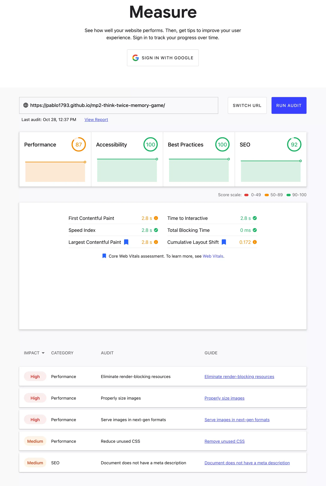

# Think-Twice

## Card Pairing Memory Game

[View deployed site here](https://pablo1793.github.io/mp2-think-twice-memory-game/)

## UX

#### Ideal user

##### The ideal user for this game is:

##### Visitors to this website are searching for:

##### This project is the best way to help them achieve these things because:

##### Client stories:

## Technologies Used

### Languages Used

* HTML5
* CSS3
* JavaScript

### Libraries & Programs Used

1. Hover.css:
    - Hover was used on the treble-clef and instrument images that appear on the front and back of the cards respectively. Hovering over the images with the cursor reduce their size somewhat.
2. Google Fonts:
    - Google Fonts were used to import the "ZCOOL Kuaile" and "Architects Daughter" fonts. Which are used on the game title and timer/flip counter text respectively.
3. Git:
    - Git was used for version control by utilizing the Gitpod terminal to commit to Git and push to Github.
4. GitHub:
    - GitHub is used to store the project's code after being pushed from Git. It also serves as a platform to deploy, clone, and share the project.
5. Gitpod:
    - Gitpod served as the online IDE in which the project was coded.
6. Balsamiq:
    - Balsamiq was used before beginning to code to create wireframes which served as reference for the design of the website. Although these wireframes do not reflect the final site design, they served as a useful foundation to build on.
7. CloudConvert:
    - cloudconvert.com was used to convert all png image files to the webp format, reducing their size and ameliorating page load time.
8. Image Resizer Online:
    - imageresizer.online was used to resize all images to match the sizes of the actual images and their rendered counterparts. This was done in order to save data a load time.
9. Gimp 2.10:
    - I used Gimp to crop screen captures, removing irrelevant image content.
10. TinyPNG:
    - TinyPNG.com was used to minify all images to reduce the game's loading time and minimise the user's data usage if not relying on a wifi connection.

## Functionality

### Non-technical

### Technical

### Existing Features

### Features to implement in future

## Installation Instructions

## Testing & Bugfixes

### HTML Testing

Using the W3C Markup Validator:

* First test indicates I did not add alt attributes to the images used and that I duplicated an ID used for the media query hiding a number of card pairs on smaller screen sizes.
* After adding alt attributes to all images and changing the duplicated IDs to classes on all relevant cards in the html file and in the media query in the css file, I run the test again. The result returns *No errors or warnings to show*.

### CSS Testing

Using the W3C CSS Validator:

* First test indicates I forgot to add the unit to the transform property on line 66.
* After correcting the error by adding the correct unit (degrees), I run the test again. The result returns *Congratulations! No Error Found*.

### JavaScript Testing

### web.dev Testing

#### Audit results screencap:

#### Audit conclusions:

1. 

### Manual testing of all elements and functionality

## Screenshots

## Credits

### Content

* The inspiration for the design of the game was taken from a two-part video lesson created by YouTube content creators [Web Dev Simplified](https://www.youtube.com/channel/UCFbNIlppjAuEX4znoulh0Cw) and [PortEXE](https://www.youtube.com/channel/UCjGQyJCSU_VVMTu5nigonqg). The [first video](https://www.youtube.com/watch?v=28VfzEiJgy4) focuses on the HTML and CSS needed to create the game, and the [second](https://www.youtube.com/watch?v=3uuQ3g92oPQ) is centered of the JavaScript functionality.

* The fonts used to style the header and subheader texts are [ZCOOL Kwaile](https://fonts.google.com/specimen/ZCOOL+KuaiLe) and [Architects Daughter](https://fonts.google.com/specimen/Architects+Daughter?preview.text=Time%20Flips&preview.text_type=custom#standard-styles) respectively. The latter was designed by [Kimberley Geswein](https://fonts.google.com/?preview.text=Time%20Flips&preview.text_type=custom&query=Kimberly+Geswein), and the former by [ZCOOL](https://fonts.google.com/?query=ZCOOL), [Liu Bingke](https://fonts.google.com/?query=Liu+Bingke), [Yang Kang](https://fonts.google.com/?query=Yang+Kang), and [Wu Shaojie](https://fonts.google.com/?query=Wu+Shaojie).

#### Images

* The **treble-clef** image used for the design on the back of the cards was downloaded from icon-library.com. Although I wasn't able to find the content contributor, here is a [link](https://icon-library.com/icon/musical-notes-icon-5.html) to the page from where it was sourced.
* The **accordion** image was downloaded from pngegg.com. I wasn't able to find its contributor either. Here is a [link](https://www.pngegg.com/en/png-zddaf) to the page where it was sourced.
* The **violin** image was downloaded from pngegg.com. I wasn't able to find its contributor. Here is a [link](https://www.pngegg.com/en/png-exaxv) to the page where the file was sourced.
* The **electric guitar** image was downloaded from clipart-library.com. Contributor not found. Here is a [link](http://clipart-library.com/clip-art/electric-guitar-silhouette-16.htm) to the page where it was sourced.
* The **guitar** image was downloaded from clipart-library.com. Contributor not found. Here is a [link](http://clipart-library.com/clip-art/electric-guitar-silhouette-21.htm) to the page where it was sourced.
* The **snare drum** image was downloaded from cleanpng.com. It was originally contributed by [Ishawar](https://www.cleanpng.com/users/@ishawar.html), and here is a [link](https://www.cleanpng.com/png-snare-drums-drum-stick-a-drum-dog-5575172/) to the page the file was sourced from.
* The **trumpet** image was downloaded from cleanpng.com. It was originally contributed by [Hobno](https://www.cleanpng.com/users/@hobno.html), and here is a [link](https://www.cleanpng.com/png-drawing-vector-graphics-clip-art-portable-network-7014149/) to the page the file was sourced from.
* The **flute** image was downloaded from pnghut.com. It was originally contributed by [Mradoii](https://pnghut.com/user/mradoii), and here is a [link](https://pnghut.com/png/SVBFi5tFvk/musical-instruments-western-concert-flute-silhouette-transparent-png#) to the page the file was sourced from.
* The **saxophone** image was downloaded from iconscout.com. It was originally contributed by [DDara](https://iconscout.com/contributors/ddara), and here is a [link](https://iconscout.com/icon/saxophone-2157836) to the page the file was sourced from.
* The **harp** image was downloaded from pngwing.com. Contributor not found. Here is a [link](https://www.pngwing.com/en/free-png-byhey) to the page where it was sourced.
* The **xylophone** image ws downloaded from vexels.com. I couldn't find its contributor, but here is a [link](https://www.vexels.com/png-svg/preview/223515/xylophone-instrument-black-design) to the page the file was sourced from.

#### Audio

* The **background drum loop** was sourced from looperman.com. This is the [page](https://www.looperman.com/loops/detail/123116/classical-drum-by-krolbeats-free-120bpm-classical-drum-loop) where I downloaded it, and [jensmuse](https://www.looperman.com/loops?mid=Krolbeats) is the artist that originally uploaded it.
* The **flip**, **match**, **victory**, and **game-over** sounds were sourced from [Zack Wilson/PortEXE's](https://github.com/portexe) gitHub page. Specifically from this [repository](https://github.com/portexe/Mix-Or-Match/tree/tutorial-code).

### Acknowledgements

#### Disclaimer

The content of this Website is for educational and entertainment purposes only.