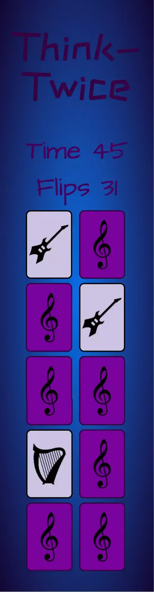

# Think-Twice

## Card Pairing Memory Game

[View deployed site here](https://pablo1793.github.io/mp2-think-twice-memory-game/)

A simple but detailed browser game in which players must find pairs of cards with identical images by flipping them over. The games features include background music and sounds indicating card flips and matches, as well as victory and game over themes reminiscent of old-school video games. There are also a timer and flip counter, to enhance the competitive nature of the game. As the goal is to match all twenty cards with the fewest possible flips and with as much time remaining as the player can manage. The images on the front and back of the cards also execute animations when hovered over or matched.

The primary goal of Think-Twice is to provide the user with an entertaining passtime. Which can be played once or many times; depending on how much the player wishes to improve on their priors efforts.

The business goal of Think-Twice is to provide a non-profit game which users can play briefly or for an extended period of time, depending on their level of interest and competitivity. Its design and implementation does not have any financial incentives.

From a user perspective, the goals vary between casual and more competitive players. As such the aim is to pass a little bit of time playing a fun, musical-themed memory game for the former. And - as mentioned earlier - the objective is to beat the game with the lowest number of flips and highest possible time remaining for the latter.
## UX

#### Ideal user

##### The ideal user for this game is:

* English speaking. Although it's not fundamental to play the game.
* Technologically literate at a beginner level.
* Someone who enjoys memory games.

##### Visitors to this website are searching for:

* A card-matching memory browser game of medium to low difficulty.
* A game that contains the option to improve on previous scores.

##### This project is the best way to help them achieve these things because:

* It can be played casually, but only grants the player 100 seconds to match all 10 pairs of cards. So it necessitates basic strategy and quick-thinking to beat.
* It can be played at a higher level of competitiveness. Since it has a limited timeframe and a counter that keeps a tab of how many times the player has flipped a card, the user can restart the game after each attempt with the aim of completing the game faster and with fewer flips than they scored previously.

##### Client stories:

1. As a new player, I want to be able to play the game without having to read an extensive list of instructions.
2. As a new player, I want to play a simple memory game to distract me during my 15-minute break.
3. As a new player, I want the game to look appealing and function intuitively.
4. As a new player, I want the game to be interactive and engaging.
5. As a returning player, I want to play the game with my child and have her understand the game in a short period of time.
6. As a returning player, I want to play for an extended period and achieve my best possible score.
7. As a returning player, I want to see some changes made to the game.

## Technologies Used

### Languages Used

* HTML5
* CSS3
* JavaScript

### Libraries & Programs Used

1. Hover.css:
    - Hover was used on the treble-clef and instrument images that appear on the front and back of the cards respectively. Hovering over the images with the cursor reduce their size somewhat.
2. Google Fonts:
    - Google Fonts were used to import the "ZCOOL Kuaile" and "Architects Daughter" fonts. Which are used on the game title and timer/flip counter text respectively.
3. Git:
    - Git was used for version control by utilizing the Gitpod terminal to commit to Git and push to Github.
4. GitHub:
    - GitHub is used to store the project's code after being pushed from Git. It also serves as a platform to deploy, clone, and share the project.
5. Gitpod:
    - Gitpod served as the online IDE in which the project was coded.
6. Balsamiq:
    - Balsamiq was used before beginning to code to create wireframes which served as reference for the design of the website. Although these wireframes do not reflect the final site design, they served as a useful foundation to build on.
7. CloudConvert:
    - cloudconvert.com was used to convert all png image files to the webp format, reducing their size and ameliorating page load time.
8. Image Resizer Online:
    - imageresizer.online was used to resize all images to match the sizes of the actual images and their rendered counterparts. This was done in order to save data a load time.
9. Gimp 2.10:
    - I used Gimp to crop any screen captures in which I needed to remove irrelevant image content.
10. TinyPNG:
    - TinyPNG.com was used to minify all images to reduce the game's loading time and minimise the user's data usage if not relying on a wifi connection.

## Functionality

### Non-technical

Upon loading the page, you will see a starting screen indicating how to intialise the game. Once you click anywhere on the screen, the game will begin and the timer will start. You have one hundred seconds to complete the game.

Under the title and timer and flip-counter subtitles you will find twenty cards upside down. To play the game all you need to do is find the ten pairs of cards. You can flip each card simply by clicking it. A flipped card will remain flipped until you click another card. If the second card is identical to the first, both cards will remain face-up. If not, both cards will return to their previous upside-down state.

If you are unable to find all ten pairs within the allotted timeframe, the game will stop and the game-over screen will appear. This screen will give you the option to restart the game.

If you manage to find all 10 pairs before the time runs out, the victory screen will activate and all cards will flip back upside down; ready for you to restart the game once more if you wish to improve on your previous score.

### Technical

The game consists of a single page containing all of the game content. Screen overlays are used for three separate purposes: to provide a starting screen, and to indicate both victory and game-over. All overlays reset the timer to 100 and the flip-counter to zero. They also each disappear once they are clicked.

Once the player clicks the starting overlay, the timer will begin to count down, and the background music will start; giving both visual and auditory indication of the start of the game. The backs of all the cards are styled identically, while their fronts represent 10 different instruments which the player must match in order to progress through the game.

When the player hovers over the images contained in the cards with the cursor, an animation will occur; reducing the size of the image somewhat. When the player clicks an upside-down card, a flip sound can be heard. And once a match is achieved, the match sound will activate and a short animation will occur. Making the identical instruments on both cards dance for a short span of time.

The player cannot cause any action on a card in three separate circumstances. First of all, if a card is clicked and is facing up, it cannot be clicked again to cause another flip. In order to progress, the player must click a different card in the effort to find the first card's pair. Second, if a pair of cards have been matched, neither can be clicked again to cause any change. And they will remain flipped until the end of the game. Finally, if an animation is happening, the card cannot be clicked. However, since the animations in question last milliseconds, the inability to click the card is barely noticeable. This last circumstance is in place mostly to avoid the player rapidly clicking multiple cards and possibly causing an error or attempting to cheat.

If the player fails to find all card pairs within the timeframe, the game-over sound and overlay will activate, giving the player the option to click to restart. If they choose to try again, the timer and flip-counter will reset and the cards will be shuffled.

If the player manages to match all ten pairs, the timer will stop and the victory overlay and sound will execute. This will cause all cards to flip back upside down, but the timer and flip-counter will not reset until the game is restarted. This is so the player can take note of their score if they so wish. Once the player clicks to restart, the timer and flip-counter will reset, and the cards will shuffle; ready for a new game.

### Existing Features

### Features to implement in future

## Installation Instructions

To clone this project into Gitpod you will need:
1. A Github account. [Create a Github account here](https://github.com/)
2. Use the Chrome browser 

Then follow these steps:
1. Go to [my GitHub profile](https://github.com/pablo1793)
2. Click "Repositories" and choose the repo named "<strong>mp1-author_website</strong>"
3. Click the dropdown labelled "<strong>Code</strong>"
4. To clone the repository using HTTPS, under "Clone with HTTPS", copy the URL link
5. Open terminal
6. Change the current working directory to the location where you want the cloned directory
7. Type "<em>git clone</em>", and then paste the URL you copied earlier
8. Press <strong>Enter</strong> to create your local clone

## Testing & Bugfixes

### HTML Testing

Using the W3C Markup Validator:

* First test indicates I did not add alt attributes to the images used and that I duplicated an ID used for the media query hiding a number of card pairs on smaller screen sizes.
* After adding alt attributes to all images and changing the duplicated IDs to classes on all relevant cards in the html file and in the media query in the css file, I run the test again. The result returns *No errors or warnings to show*.

### CSS Testing

Using the W3C CSS Validator:

* First test indicates I forgot to add the unit to the transform property on line 66.
* After correcting the error by adding the correct unit (degrees), I run the test again. The result returns *Congratulations! No Error Found*.

### JavaScript Testing

Using jshint.com validator:

* First test returned multiple warnings concerning 'esversion: 6'. Although the warning related to my use of classes, arrow function syntax, and declaring variables with const and let; they all appeared to circle back to the same issue.
* After some research I found an answer in this [post](https://stackoverflow.com/questions/27441803/why-does-jshint-throw-a-warning-if-i-am-using-const) on StackOverflow. So I added this comment - /* jshint esversion: 6 */ - at the top of my script.js file and tested the code again. The second test returned *No warnings*.

### web.dev Testing

#### Audit results screencap:

#### Audit conclusions:

1. The render-blocking resources which the audit refers to are the fonts that I am using from Google Fonts. As I cannot eliminate them I consider this issue to be out of my scope of control.
2. After seeing the results of the audit, I resized all of the images used in the game to be the same size as they are when they are rendered. And also changed their format from PNG to WEBP. As well as minified all images to reduce their data comsumption as much as possible.
3. After reviewing my style.css file, I concluded none of the code to be superfluous.
4. I added the meta description tag to the head in my index.html file.

### Testing client stories from UX section of README.md

1. As a new player, I want to be able to play the game without having to read an extensive list of instructions.
    * This player will find minimal instructions in the form of prompts in the screen overlays. These are limited to indicating they should click to either start or restart the game. Meanwhile, the gameplay itself is basic enought to not require instructions.
2. As a new player, I want to play a simple memory game to distract me during my 15-minute break.
    * The game will fit into this user's 15 minute timeframe nicely. Whether they choose to play once or a number of times. As it requires no preparation, and each attempt will last at most 100 seconds.
3. As a new player, I want the game to look appealing and function intuitively.
    * The game is designed with a pleasant colour scheme and simple required actions; mainly limited to clicking to start the game, restart the game, and choosing which card to flip.
4. As a new player, I want the game to be interactive and engaging.
    * The sounds employed in the game are used to indicate responses to the users actions. The theme and background music appeal to the general interest people have in music.
5. As a returning player, I want to play the game with my child and have her understand the game in a short period of time.
    * The game is simple and is designed to be played for players of any age. As such, this player's child should find the gameplay easy and intuitive in its simplicity.
6. As a returning player, I want to play for an extended period and achieve my best possible score.
    * The game can be played for as long as the player desires. The timer and flip-counter allow for competitive gameplay with oneself or others. Since beating the game can be improved upon by completing it with less flips and more remaining time.
7. As a returning player, I want to see some changes made to the game.
    * The game is still in the same form as its original deployment. But in future a navbar will be added, giving the option to swich to another set of cards with a different theme, soundtrack, and colour scheme.

### Manual testing of all elements and functionality

1. Start overlay:
    * Upon loading the page, the 'Click to Start' overlay is present.
    * Change screen size from desktop to tablet to make sure the overlay is responsive.
    * Change screen size from tablet to mobile to ensure responsiveness.
    * Once screen is clicked, overlay disappears on all screen sizes, background music starts playing, and game begins.

2. Timer:
    * Once start overlay disappears on desktop screen size check timer starts counting down second by second from 100 to 0.
    * Check the timer functionality on tablet and mobile screen sizes to ensure responsiveness.
    * After game-over and victory overlays are clicked, check that timer resets to 100 as the game restarts and begins the countdown once more.
    * Check this same functionality on tablet and mobile screen sizes.

3. Flips counter:
    * Check that the counter adds 1 every time a card is clicked.
    * Make sure this functionality is maintained on tablet and mobile screen sizes.

4. Cards:
    1. Card back:
        * Check that treble-clef size is reduced when hovered over with cursor on desktop.
        * On tablet and mobile screens, check that treble-clef image starts at reduced size and increases to full size once clicked.
    2. Card front:
        * Repeat same test done with treble-clef image for all instrument images on front of cards. At desktop screen size the instruments reduce in size somewhat when hovered over.
        * At tablet and mobile screen sizes check that this animation does not occur since flipped cards cannot be clicked. 
    3. Card flip: 
        * Make sure that the flip sound executes every time any of the cards are clicked.
        * Test the delay between clicks. Cards cannnot be repeatedly clicked one after the other.
        * Check the flip itself is fluid and looks realistic.
        * Repeat these tests for tablet and mobile screen sizes.
    4. Card match:
        * Make sure the card match sound executes whenever two identical cards are flipped.
        * Check that the instrument image animation executes upon match.
        * Check that cards remain face-up after being matched.
        * Repeat test on tablet and mobile screen sizes.
    5. On mobile screens specifically:
        * Check that just 10 cards appear, providing only 5 pairs of cards. The remaining cards are properly hidden.

5. Game Over overlay:
    1. Before clicking:
        * Check that game-over sound plays and overlay appears when timer runs out.
        * Check that timer remains at zero and flip-counter maintains the number of flips made during the game.
        * Repeat for tablet and mobile screen sizes.
    2. After clicking:
        * Check that timer and flip counter reset, and that all cards return to their upside down state. And the game restarts.
        * Check same on tablet and mobile screen sizes.

6. Victory overlay:
    1. Before clicking:
        * Check that victory sound plays and overlay appears once all pairs of cards are matched.
        * Make sure timer and flip-counter remain with the values they had at the moment of completing the last match.
        * Check that all cards flip back to their upside-down state once victory overlay appears.
        * Repeat tests for tablet screen size.
        * On mobile screen size, make sure the victory sound plays and overlay appears despite half of the cards being hidden.
    2. After clicking:
        * Check that timer and flip counter reset. And the game restarts.
        * Check same on tablet and mobile screen sizes.

7. Shuffle:
    * Check that cards are shuffled upon starting a new game.
    * Check that cards shuffle after clicking the game-over overlay and restart the game.
    * Check that cards shuffle after clicking the victory overlay and restart the game.

## Screenshots

### Wireframes

The following are images of the wireframes I made before beginning to code the game. Although the final desgin is significantly different from the initial design that these wireframes show, they reflect what my initial idea was.

### Final Game Design

The following image shows the starting screen before the game has commenced:

The following image shows the game being played:

The following image shows how the game looks after an unsuccesful attempt:

The following image shows how the game looks after a succesful completion:

The following image shows what the game looks like when played on a tablet:

The following image shows what the game looks like when played on a mobile phone:

## Credits

### Content

* The inspiration for the technical composition of the game was taken from a two-part video lesson created by YouTube content creators [Web Dev Simplified](https://www.youtube.com/channel/UCFbNIlppjAuEX4znoulh0Cw) and [PortEXE](https://www.youtube.com/channel/UCjGQyJCSU_VVMTu5nigonqg). The [first video](https://www.youtube.com/watch?v=28VfzEiJgy4) focuses on the HTML and CSS needed to create the game, and the [second](https://www.youtube.com/watch?v=3uuQ3g92oPQ) is centered of the JavaScript functionality. Most of the HTML, CSS, and JavaScript code is taken from these videos, although none of it was copied and pasted from the GitHub repository. I watched the videos multiple times and coded along with both content creators. Moreover, the code is not identical. Since I made changes during the process of coding in order to achieve the look and functionality I was aiming for with my own finished game, which differs in a few key aspects from their Halloween-themed game. 
To give a few examples: the theme, colour scheme, card design, and background music for my game are all completely different. Furthermore, my game gives more consideration to responsiveness. Reducing the size of the cards on smaller screens, and hiding half of the cards in order to minimize scrolling.

* The fonts used to style the header and subheader texts are [ZCOOL Kwaile](https://fonts.google.com/specimen/ZCOOL+KuaiLe) and [Architects Daughter](https://fonts.google.com/specimen/Architects+Daughter?preview.text=Time%20Flips&preview.text_type=custom#standard-styles) respectively. The latter was designed by [Kimberley Geswein](https://fonts.google.com/?preview.text=Time%20Flips&preview.text_type=custom&query=Kimberly+Geswein), and the former by [ZCOOL](https://fonts.google.com/?query=ZCOOL), [Liu Bingke](https://fonts.google.com/?query=Liu+Bingke), [Yang Kang](https://fonts.google.com/?query=Yang+Kang), and [Wu Shaojie](https://fonts.google.com/?query=Wu+Shaojie).

* The code to shuffle the cards is based on an [algorithm](https://en.wikipedia.org/wiki/Fisher%E2%80%93Yates_shuffle) first described by Ronald Fisher and Frank Yates. It is known as the Fisher-Yates shuffle.

#### Images

* The **treble-clef** image used for the design on the back of the cards was downloaded from icon-library.com. Although I wasn't able to find the content contributor, here is a [link](https://icon-library.com/icon/musical-notes-icon-5.html) to the page from where it was sourced.
* The **accordion** image was downloaded from pngegg.com. I wasn't able to find its contributor either. Here is a [link](https://www.pngegg.com/en/png-zddaf) to the page where it was sourced.
* The **violin** image was downloaded from pngegg.com. I wasn't able to find its contributor. Here is a [link](https://www.pngegg.com/en/png-exaxv) to the page where the file was sourced.
* The **electric guitar** image was downloaded from clipart-library.com. Contributor not found. Here is a [link](http://clipart-library.com/clip-art/electric-guitar-silhouette-16.htm) to the page where it was sourced.
* The **guitar** image was downloaded from clipart-library.com. Contributor not found. Here is a [link](http://clipart-library.com/clip-art/electric-guitar-silhouette-21.htm) to the page where it was sourced.
* The **snare drum** image was downloaded from cleanpng.com. It was originally contributed by [Ishawar](https://www.cleanpng.com/users/@ishawar.html), and here is a [link](https://www.cleanpng.com/png-snare-drums-drum-stick-a-drum-dog-5575172/) to the page the file was sourced from.
* The **trumpet** image was downloaded from cleanpng.com. It was originally contributed by [Hobno](https://www.cleanpng.com/users/@hobno.html), and here is a [link](https://www.cleanpng.com/png-drawing-vector-graphics-clip-art-portable-network-7014149/) to the page the file was sourced from.
* The **flute** image was downloaded from pnghut.com. It was originally contributed by [Mradoii](https://pnghut.com/user/mradoii), and here is a [link](https://pnghut.com/png/SVBFi5tFvk/musical-instruments-western-concert-flute-silhouette-transparent-png#) to the page the file was sourced from.
* The **saxophone** image was downloaded from iconscout.com. It was originally contributed by [DDara](https://iconscout.com/contributors/ddara), and here is a [link](https://iconscout.com/icon/saxophone-2157836) to the page the file was sourced from.
* The **harp** image was downloaded from pngwing.com. Contributor not found. Here is a [link](https://www.pngwing.com/en/free-png-byhey) to the page where it was sourced.
* The **xylophone** image ws downloaded from vexels.com. I couldn't find its contributor, but here is a [link](https://www.vexels.com/png-svg/preview/223515/xylophone-instrument-black-design) to the page the file was sourced from.

#### Audio

* The **background drum loop** was sourced from looperman.com. This is the [page](https://www.looperman.com/loops/detail/123116/classical-drum-by-krolbeats-free-120bpm-classical-drum-loop) where I downloaded it, and [jensmuse](https://www.looperman.com/loops?mid=Krolbeats) is the artist that originally uploaded it.
* The **flip**, **match**, **victory**, and **game-over** sounds were sourced from [Zack Wilson/PortEXE's](https://github.com/portexe) gitHub page. Specifically from this [repository](https://github.com/portexe/Mix-Or-Match/tree/tutorial-code).

### Acknowledgements

#### Disclaimer

The content of this Website is for educational and entertainment purposes only.